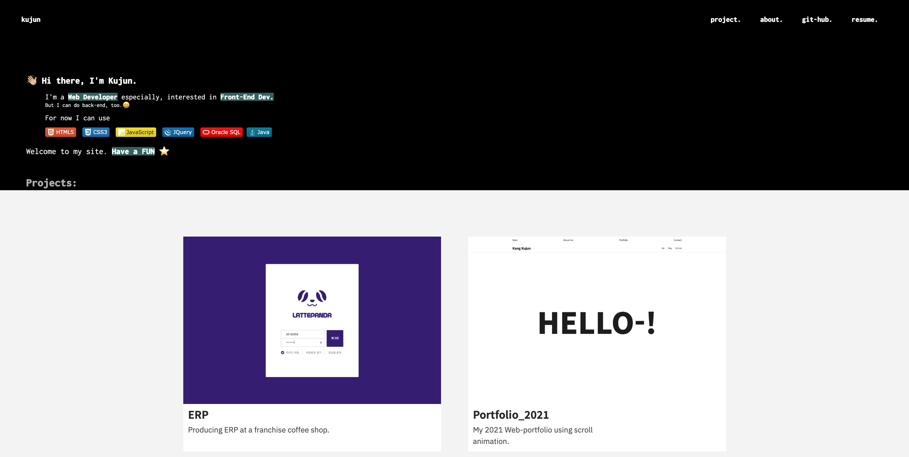
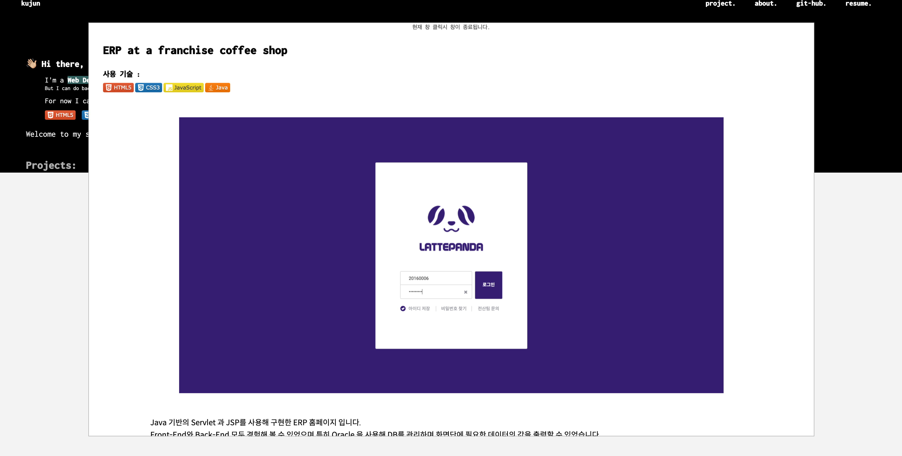
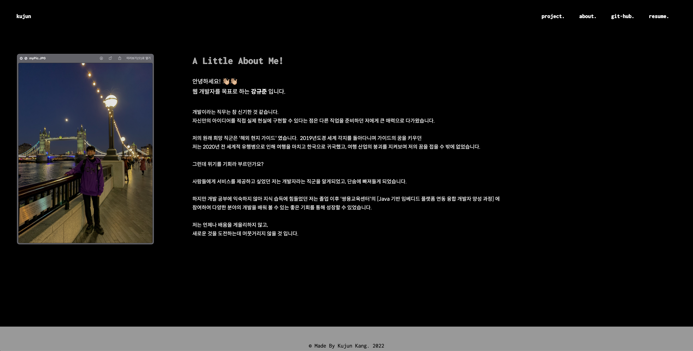

# portfolio_2022
## Description
동적인 포트폴리오 이외로 정적인 포트폴리오 홈페이지가 필요하다는 생각에 제작한 뉴 2022 포트폴리오 홈페이지 
 
## Files
해당 저장소는 이러한 파일들을 포함합니다:
- about : 자기소개가 담긴 페이지가 포함되어 있습니다.
- assets : 페이지에 사용된 이미지들이 포함되어 있습니다.
- style : CSS 파일들이 포함되어 있습니다.
- index.html : 홈화면 html 파일 입니다.

## Environment

- OS
  - Mac

- IDE
  - VScode

- Language
  - HTML5
  - CSS3
  - JavaScript

 
## Feature

 
1. 메인화면 입니다. 프로젝트 나열은 Grid 를 사용하여 출력하였습니다. 
 

 
2. 프로젝트에 대한 설명이 담긴 모달창입니다. click 이벤트를 적용시켰으며 현재 창을 재 클릭시 창이 종료되며, 모달창이 띄어진 상태에서는 메인 화면의 Scroll이 disabled화 됩니다. 
 

 
3. 저의 자기소개가 담긴 페이지입니다. flex를 사용하여 레이아웃을 설정하였습니다.